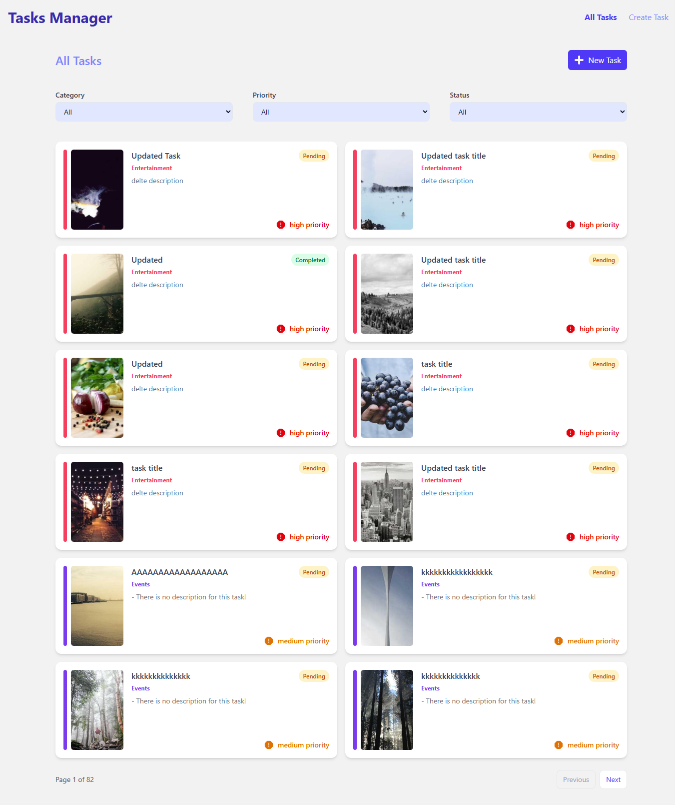
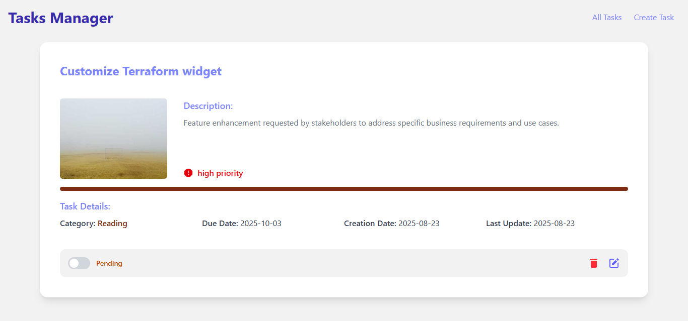
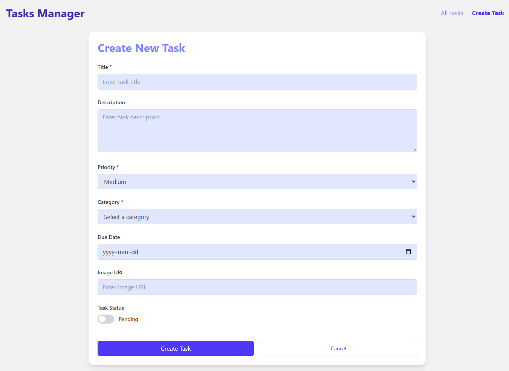
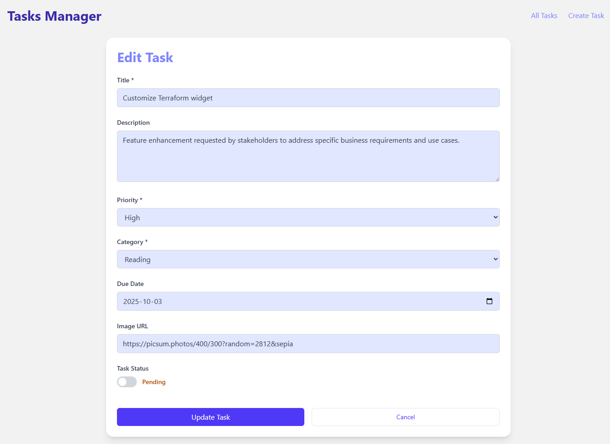

# Task Manager

A modern, full-featured task management application built with React and Vite. This application provides a comprehensive solution for managing tasks with categories, priorities, due dates, and more.

## Screenshots

### Home Page



### Task Details



### Create Task Form



### Edit Task Form



## Features Implemented

### Core Functionality

- **Task Management**: Create, read, update, and delete tasks
- **Task Details**: Comprehensive task view with image support, descriptions, and metadata
- **Task Status**: Toggle between completed and pending states
- **Priority System**: Low, medium, and high priority levels with color coding
- **Category Management**: Organize tasks by custom categories
- **Due Dates**: Set and track task deadlines
- **Image Support**: Attach images to tasks with fallback handling

### User Experience

- **Responsive Design**: Mobile-first approach with Tailwind CSS
- **Real-time Updates**: Instant UI updates with optimistic mutations
- **Loading States**: Skeleton loaders for better perceived performance
- **Error Handling**: Comprehensive error handling with user-friendly messages
- **Toast Notifications**: Success and error feedback using react-hot-toast
- **Pagination**: Efficient task browsing with pagination controls
- **Filtering**: Filter by category, status, and priority

### Technical Features

- **Server State Management**: TanStack Query for efficient data fetching and caching
- **Optimistic Updates**: Immediate UI feedback with rollback on errors
- **Image Fallbacks**: Graceful handling of missing or broken images
- **Form Validation**: Client-side validation with error messages
- **Loading Skeletons**: Enhanced UX during data fetching

## Setup and Run Instructions

### Prerequisites

- Node.js (version 16 or higher)
- npm or yarn package manager

### Installation

1. **Clone the repository**

   ```bash
   git clone <repository-url>
   cd taskManager
   ```

2. **Install dependencies**

   ```bash
   npm install
   ```

3. **Environment Variables**
   Create a `.env` file in the root directory with the following variables:

   ```env
   VITE_SUPABASE_URL=your_supabase_url
   VITE_SUPABASE_KEY=your_supabase_anon_key
   ```

4. **Run the development server**

   ```bash
   npm run dev
   ```

5. **Build for production**

   ```bash
   npm run build
   ```

6. **Preview production build**
   ```bash
   npm run preview
   ```

### Why React over Vue?

**React was chosen for this project because:**

1. **Ecosystem & Community**: React has a larger ecosystem with more third-party libraries and community support.
2. **TanStack Query Integration**: Better integration with TanStack Query (formerly React Query) for server state management.
3. **Component Reusability**: React's component-based architecture aligns well with the task management UI patterns.
4. **Developer Experience**: Excellent tooling with Vite, ESLint, and React DevTools.
5. **Performance**: React's virtual DOM and efficient re-rendering work well for dynamic task lists.
6. **Personal Reason**: I already did similar task using VUE Composition & Pinia.

## State Management Approach

### Server State Management

- **TanStack Query**: Handles all server state, caching, and synchronization
- **Query Keys**: Organized by resource type (`['tasks']`, `['categories']`, `['task', id]`)
- **Automatic Refetching**: Smart background updates and cache invalidation
- **Optimistic Updates**: Immediate UI feedback with automatic rollback on errors

### Local State Management

- **React useState**: Component-level state for forms and UI interactions
- **React Router**: URL state management for navigation and filters
- **Context API**: Shared state through React Router's Outlet context

### State Flow Architecture

```
Server State (TanStack Query)
    ↓
Component State (useState)
    ↓
UI Updates (Optimistic)
    ↓
Server Sync (Mutations)
    ↓
Cache Invalidation
```

## 🔧 Technical Stack

- **Frontend**: React 19, Vite, Tailwind CSS
- **State Management**: TanStack Query, React Router
- **HTTP Client**: Axios
- **Notifications**: React Hot Toast
- **Icons**: React Icons
- **Skeletons**: React Loading Skeletons
- **API**: Supabase
- **Build Tool**: Vite
- **Linting**: ESLint
